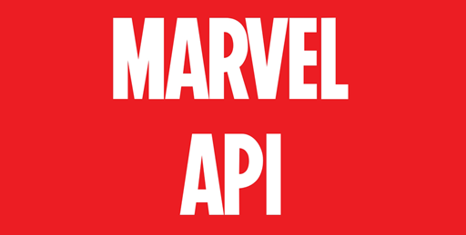
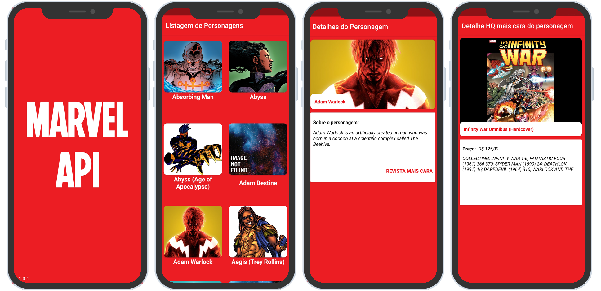
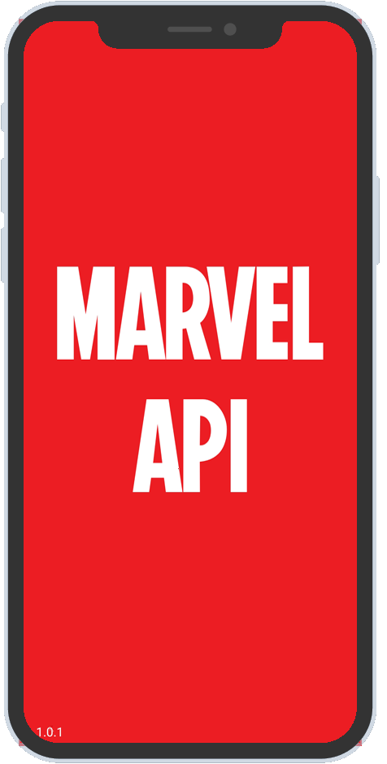
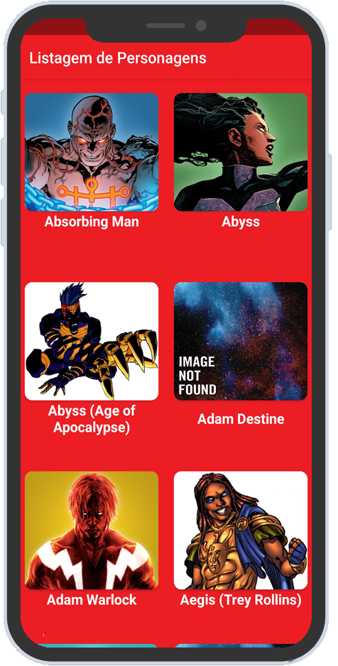
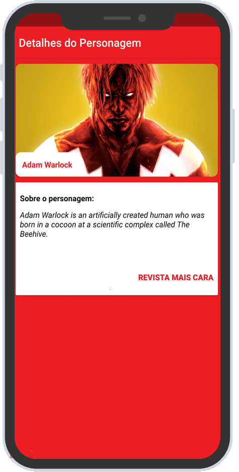
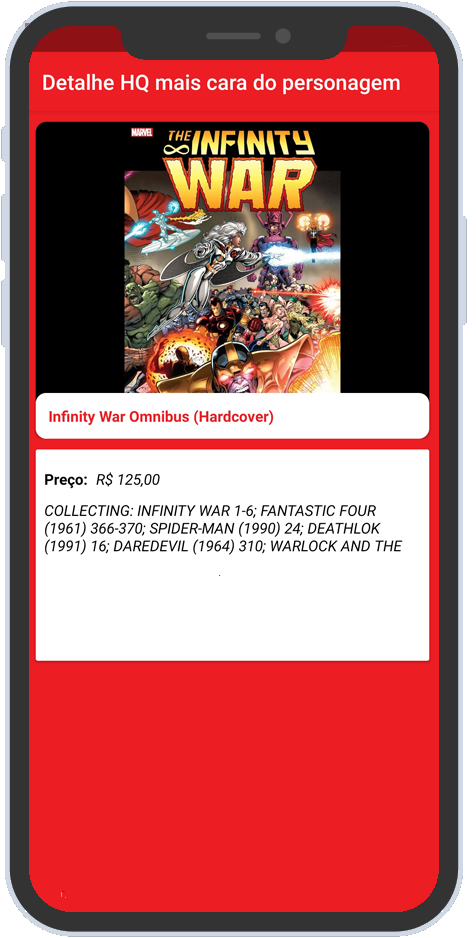

<h1 align="center">
    
</h1>

<h4 align="center"> 
  Desafio Android Robson Lima - Marvel API
</h4>

  
  

  

  <a href="#rocket-tecnologias">Tecnologias</a>&nbsp;&nbsp;&nbsp;|&nbsp;&nbsp;&nbsp;
  <a href="#-projeto">Projeto</a>&nbsp;&nbsp;&nbsp;|&nbsp;&nbsp;&nbsp;
  <a href="#-screenshots">Screenshots</a>&nbsp;&nbsp;&nbsp;|&nbsp;&nbsp;&nbsp;
  <a href="#memo-licença">Licença</a>

 

  

## :rocket: Tecnologias

Para o desenvolvimento do projeto foi utilizada uma stack com as seguintes tecnologias:

- :earth_americas: **[Retrofit](https://square.github.io/retrofit/)** — Cliente HTTP para Android e Java
- :earth_americas: **[OkHttp](https://square.github.io/okhttp/)** — Um cliente HTTP & HTTP/2 para Android e Java
- 💅 **[Picasso](https://square.github.io/picasso/)** — Uma biblioteca poderosa para download e caching de imagens para Android
- ⚛️ **[Constraint Layout](https://developer.android.com/training/constraint-layout)** — Layout para criar UI responsiva

## 💻 Projeto

O app é um projeto que visa exibir uma listagem de personagens a partir da comunicação com a MARVEL API (http://gateway.marvel.com/v1/public/characters), além disso é possível visualizar informações detalhadas dos personagens (Foto, Nome, Descrição) e visualizar a revista mais cara do personagem selecionado pelo usuário (http://gateway.marvel.com/v1/public/{characterId}/comics).

## 🔖 Screenshots

## :memo: Licença

Esse projeto está sob a licença MIT. Veja o arquivo [LICENSE](LICENSE.md) para mais detalhes.

---

Feito com :sparkling_heart: e ☕ por Robson Lima para o Desafio Android Accenture - Marvel API